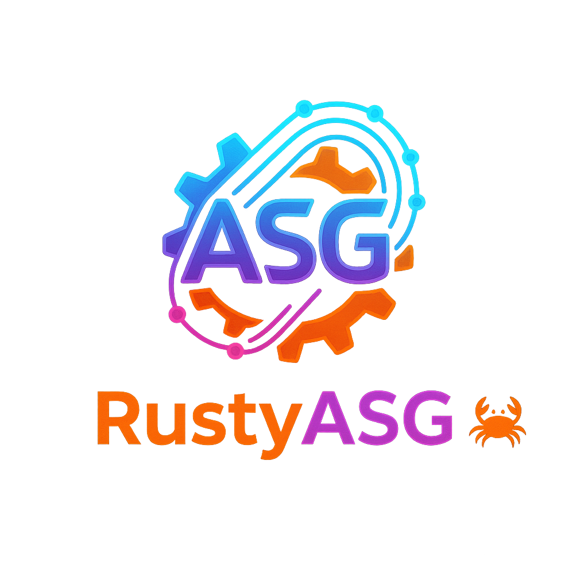

# RustyASG: Графовый движок для глубокого обучения на Rust

**RustyASG** — это современный экспериментальный фреймворк для глубокого обучения на Rust с уникальной возможностью **интерактивной визуализации графа в реальном времени**. Его ключевая особенность — архитектура, построенная вокруг **Абстрактного Семантического Графа (ASG)**, которая обеспечивает максимальную производительность, гибкость и беспрецедентный контроль над моделью.

Вместо немедленного выполнения операций (eager execution), как в PyTorch, RustyASG сначала строит полный граф вычислений. Этот граф затем может быть статически проанализирован, оптимизирован и выполнен на различных бэкендах, включая **высокопроизводительные вычисления на GPU** с помощью `wgpu`.

[](https://opensource.org/licenses/MIT)
[](https://www.rust-lang.org/)
[](CONTRIBUTING.md)

---

## 🔥 Философия проекта

RustyASG придерживается нескольких ключевых принципов:

*   🚀 **Производительность через графы:** Подход "define-then-run" позволяет проводить глобальные оптимизации, такие как слияние операций (kernel fusion) и статическое распределение памяти, что недостижимо для фреймворков с немедленным выполнением.
*   🔒 **Безопасность и надежность Rust:** Использование Rust гарантирует безопасность работы с памятью и параллелизм без гонок данных, что критически важно для сложных вычислительных систем.
*   🔬 **Полный контроль и прозрачность:** Вы имеете полный контроль над графом вычислений. Его можно инспектировать, изменять и, самое главное, **визуализировать** до и во время запуска, что делает процесс отладки и понимания модели значительно проще.
*   🎓 **Образовательный инструмент:** Проект является отличным примером того, как современные deep learning фреймворки устроены "под капотом", от символьного API до GPU-бэкенда и автоматического дифференцирования.

## ✅ Ключевые возможности

- **Динамическое построение графа:** Легковесный `Tensor` API позволяет интуитивно строить граф вычислений.
- **✨ Встроенная интерактивная визуализация графа:** Запускайте вычисления вместе с нативным GUI-окном, которое отрисовывает структуру вашего графа в реальном времени. Полностью на Rust (`egui`), **без внешних зависимостей** (не требуется установка Graphviz).
- **Автоматическое дифференцирование:** Мощный механизм "граф-в-граф", который генерирует новый ASG для вычисления градиентов.
- **Поддержка нескольких бэкендов:**
    - ✅ **CPU-бэкенд:** Полностью функциональная эталонная реализация на `ndarray`.
    - ✅ **GPU-бэкенд:** Высокопроизводительное выполнение на GPU через `wgpu` (WebGPU).
- **Статический анализ:** Встроенный механизм вывода размерностей (`Shape Inference`) для проверки корректности графа до его выполнения.
- **Современные архитектуры:** Реализованы все необходимые блоки для построения полноценной модели **Transformer**.

---

## 🏗️ Архитектура

Архитектура фреймворка строго разделена на независимые модули, взаимодействующие через четко определенные интерфейсы.

```
┌───────────────────────────────────┐
│     Пользовательский API (Tensor) │
└─────────────────┬─────────────────┘
                  │ (строит граф)
                  V
┌───────────────────────────────────┐
│Абстрактный Семантический Граф (ASG) ◀───┐ (отправляется в GUI)
│ (описание вычислений)             │       │
└─────────────────┬─────────────────┘       │
                  │                         │
        ┌─────────┴─────────┐               │
        │                   │               │
        V                   V               V
┌───────┴───────┐     ┌─────┴───────┐   ┌───┴───┐
│ Autograd      │     │ Runtime     │   │ GUI   │
│ (граф -> граф)│     │ (исполнение)│   │ Viewer│
└───────────────┘     └──────┬──────┘   └───────┘
                               │
                     ┌─────────┴─────────┐
                     │                   │
                     V                   V
               ┌─────┴─────┐       ┌─────┴─────┐
               │CPU Backend│       │GPU Backend│
               └───────────┘       └───────────┘
```

---

## 🚀 Начало работы

### Требования
*   [Rust](https://www.rust-lang.org/tools/install) (версия 1.70 или новее)
*   `cargo` (обычно устанавливается вместе с Rust)

### Установка и запуск

1.  **Клонируйте репозиторий:**
    ```bash
    git clone https://github.com/Xzdes/RustyAsg.git
    cd RustyAsg
    ```

2.  **Выберите режим запуска:**

    *   **А) Стандартный запуск (только вычисления в консоли):**
        ```bash
        cargo run --release
        ```
        *Использование флага `--release` настоятельно рекомендуется для получения максимальной производительности.*

    *   **Б) Запуск с интерактивной визуализацией:**
        ```bash
        cargo run --release -- --visualize
        ```
        **ВАЖНО:** Двойной дефис (`--`) необходим, чтобы передать флаг `--visualize` вашей программе, а не `cargo`.

---

## ✨ Демонстрация

При запуске с флагом `--visualize` вы увидите два окна:
1.  **Консоль**, где будет отображаться лог построения графа и процесс обучения.
2.  **Интерактивное окно визуализатора**, где будет отрисован ваш граф. Вы можете перемещать вид, зажав левую кнопку мыши.

#### Консольный вывод:
```bash
[GUI] Запуск GUI в основном потоке...
[COMPUTATION] Запуск вычислительного потока...
--- Демонстрация полного цикла обучения RustyASG ---
[Config] Backend: GPU (wgpu)

[1] Граф прямого прохода успешно построен.
[2] Анализ форм (Shape Inference) для прямого графа завершен.
[3] Граф градиентов построен и проанализирован.

[+] Отправка графа прямого прохода в окно визуализации...
[4] Данные, веса и оптимизатор инициализированы.

--- НАЧАЛО ЦИКЛА ОБУЧЕНИЯ ---

Эпоха: 1 , Потери (Loss): 1.528345
Эпоха: 2 , Потери (Loss): 1.377164
...
Эпоха: 15, Потери (Loss): 0.370134

--- ОБУЧЕНИЕ ЗАВЕРШЕНО ЗА 3.25s ---
```

#### Окно визуализатора:
*(Замените `screenshot.png` на путь к вашему скриншоту)*


---

## 🗺️ Дорожная карта (Roadmap)

Проект активно развивается. Вот некоторые из ключевых направлений для будущей работы:

#### (High Priority)
- [ ] **Исправить градиент для `LayerNorm`:** Градиент для параметров `gamma` и `beta` в `autograd` реализован некорректно и временно отключен в примере. Это главная задача для дальнейшей работы.

#### (Core Improvements)
- [ ] Расширить `autograd` для поддержки большего числа операций.
- [ ] Реализовать более продвинутые оптимизаторы (`Adam`, `AdamW`).
- [ ] Добавить поддержку батчей произвольного размера в API и бэкендах.

#### (Визуализатор)
- [ ] Добавить возможность переключения между графом прямого прохода и графом градиентов в GUI.
- [ ] Отображать больше информации об узлах при наведении (например, точные значения констант).
- [ ] Реализовать подсветку пути при клике на узел.

#### (Backend Optimizations)
- [ ] **Kernel Fusion:** Реализовать проход оптимизации, который объединяет несколько последовательных операций в один кастомный WGSL-шейдер.
- [ ] **Управление памятью:** Создать более умный аллокатор для GPU-буферов, чтобы переиспользовать память.

## 🙌 Вклад в проект (Contributing)

Приветствую любой вклад в развитие RustyASG! Если вы хотите помочь, пожалуйста, ознакомьтесь с `CONTRIBUTING.md` (пока не создан) или просто:

1.  Сделайте форк репозитория.
2.  Создайте новую ветку для вашей фичи или исправления (`git checkout -b feature/my-new-feature`).
3.  Внесите изменения и сделайте коммит (`git commit -am 'Add some feature'`).
4.  Отправьте изменения в ваш форк (`git push origin feature/my-new-feature`).
5.  Создайте Pull Request.

Также не стесняйтесь создавать **Issues** для сообщений об ошибках или предложений по улучшению.

## 📄 Лицензия

Этот проект распространяется под лицензией MIT. Подробности смотрите в файле `LICENSE`.