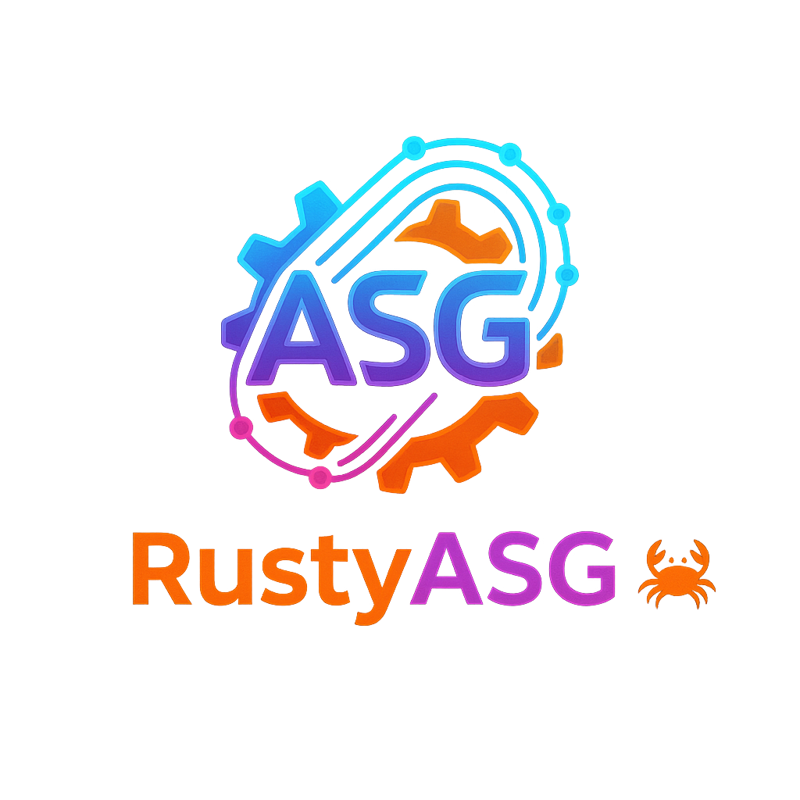

# RustyASG: графовый движок глубокого обучения на Rust

**RustyASG** — современный экспериментальный фреймворк глубокого обучения на
чистом Rust с уникальной возможностью **интерактивной визуализации графа в
реальном времени**. Ключевая особенность — архитектура вокруг **Абстрактного
Семантического Графа (Abstract Semantic Graph, ASG)**, обеспечивающая
максимальную производительность, гибкость и прозрачность модели.

В отличие от фреймворков с немедленным исполнением (eager execution), как
PyTorch, RustyASG сначала строит полный граф вычислений. Затем этот граф может
быть статически проанализирован, оптимизирован и исполнен на разных бэкендах,
включая **GPU через `wgpu`** (WebGPU/Vulkan/Metal/DX12).

> Этот файл — зеркало английского [README.md](README.md). Полная актуальная
> информация всегда в английской версии.

[](https://crates.io/crates/rustyasg)
[](https://docs.rs/rustyasg)
[](https://github.com/Xzdes/RustyAsg/actions/workflows/ci.yml)
[](https://opensource.org/licenses/MIT)
[](https://www.rust-lang.org/)
[](CONTRIBUTING.md)

---

## Философия проекта

- **Производительность через графы.** Подход «define-then-run» даёт
  глобальные оптимизации — fusion операций, статическое планирование
  памяти, — недостижимые в eager-фреймворках.
- **Безопасность Rust.** Отсутствие UB, data races и сегфолтов —
  критичные свойства для долгих обучающих циклов.
- **Контроль и прозрачность.** Граф вычислений инспектируется,
  модифицируется и **визуализируется** в реальном времени. Отладка и
  обучение модели становятся намного проще.
- **Образовательная ценность.** Хорошая демонстрация того, как устроены
  современные DL-фреймворки «под капотом» — от символического API до
  WGSL-шейдеров и графового autograd.

## Основные возможности

- **Декларативный API слоёв (v0.3+).** `Linear::new(ctx, "fc1", 784, 128)` —
  слой сам регистрирует форму и инициализатор параметра.
  `GraphContext::init_parameters()` автоматически сэмплирует веса.
  Никаких ручных `HashMap<String, Shape>` и сопоставлений имён через строки.
- **Встроенный интерактивный визуализатор графа.** Нативное GUI-окно на
  `egui` отрисовывает структуру графа в реальном времени. Полностью на
  Rust, без внешних зависимостей (Graphviz не требуется).
- **Автоматическое дифференцирование «граф-в-граф».** Получаем новый
  ASG, вычисляющий градиенты — его тоже можно оптимизировать и
  визуализировать.
- **Два бэкенда:**
  - ✅ **CPU** — полная эталонная реализация на `ndarray`.
  - ✅ **GPU (wgpu)** — LayerNorm (fwd+bwd), Conv2d (fwd+bwd), Pooling
    (Max/Avg/Adaptive), Embedding, ConvTranspose2d, Slice/Concat.
    TransformerBlock обучается полностью на GPU. 46 тестов на
    численное совпадение GPU↔CPU.
- **Статический анализ.** `ShapeInference` проверяет корректность графа
  ещё до запуска.
- **Transformer и CNN:** Multi-Head Attention с масками, LayerNorm,
  FeedForward, Conv2d / ConvTranspose2d, Pooling, эмбеддинги
  (Sinusoidal, Learned, **полный RoPE**, ALiBi), Slice/Concat с
  автоградом.
- **Обучение:** SGD / Adam / AdamW / RMSprop, 5 LR-шедьюлеров, gradient
  clipping, 14 функций потерь, 9 инициализаторов весов
  (Xavier/Kaiming/Normal/...).
- **Данные и метрики:** `Dataset` / `DataLoader` с самплерами и
  трансформациями, classification + regression метрики, `EarlyStopping`.
- **Сериализация:** SafeTensors + система чекпоинтов с ротацией.
- **CI/CD:** GitHub Actions matrix (Linux/Windows/macOS), строгие
  `cargo fmt`, `cargo clippy -- -D warnings`, `cargo doc`, **141 тест**.
- **Готов к crates.io:** полная metadata, thin-LTO release-профиль,
  `docs.rs` конфигурация.

## Пример: XOR за 20 строк (v0.3+)

```rust
use rustyasg::nn::{Linear, Module};
use rustyasg::tensor::{GraphContext, Tensor};
use rustyasg::losses::mse_loss;
use std::{cell::RefCell, rc::Rc};

let ctx = Rc::new(RefCell::new(GraphContext::new()));

let x      = Tensor::new_input(&ctx, "x");
let y_true = Tensor::new_input(&ctx, "y_true");

// Слои сами регистрируют формы и инициализаторы в GraphContext.
let fc1 = Linear::new(&ctx, "fc1", 2, 8);
let fc2 = Linear::new(&ctx, "fc2", 8, 1);

let y_pred = fc2.forward(&fc1.forward(&x).relu()).sigmoid();
let loss   = mse_loss(&y_pred, &y_true);
```

Полный training loop — в [`examples/xor.rs`](examples/xor.rs).

## Архитектура

```
┌───────────────────────────────────┐
│    Пользовательский API (Tensor)  │
└─────────────────┬─────────────────┘
                  │ (строит граф)
                  ▼
┌───────────────────────────────────┐
│ Абстрактный Семантический Граф    │◀──┐ (отправляется в GUI)
│ (описание вычислений)             │   │
└─────────────────┬─────────────────┘   │
                  │                     │
        ┌─────────┼─────────┐           │
        ▼         ▼         ▼           │
  ┌─────────┐ ┌───────┐ ┌────────┐      │
  │Autograd │ │Runtime│ │ GUI    │──────┘
  │(граф →  │ │       │ │ Viewer │
  │ граф)   │ │       │ └────────┘
  └─────────┘ └───┬───┘
                  │
            ┌─────┴─────┐
            ▼           ▼
       ┌────────┐  ┌────────┐
       │  CPU   │  │  GPU   │
       │Backend │  │(wgpu)  │
       └────────┘  └────────┘
```

## Быстрый старт

**Требования:** Rust 1.75+ (`rustup install stable`).

```bash
git clone https://github.com/Xzdes/RustyAsg.git
cd RustyAsg

# Тренируем TransformerBlock (CPU по умолчанию)
cargo run --release

# Тренируем тот же блок на GPU через wgpu
cargo run --release -- --gpu

# Тренируем TransformerBlock с интерактивным графом (egui GUI)
cargo run --release -- --visualize

# Запускаем примеры
cargo run --release --example xor                    # 2-слойный MLP, XOR
cargo run --release --example linear_regression      # y = wx + b
cargo run --release --example pattern_recognition    # MLP для 4 паттернов, 100%
cargo run --release --example mnist                  # MLP для синтетического MNIST, 100%
cargo run --release --example cnn_classifier         # Conv2d + Pool + Linear, 100%
cargo run --release --example transformer_classifier # Attention-style классификатор
```

## Примеры

| Файл | Архитектура | Задача | Точность |
|------|-------------|--------|----------|
| [`xor.rs`](examples/xor.rs) | MLP 2→8→1 | XOR | loss < 0.0001 |
| [`linear_regression.rs`](examples/linear_regression.rs) | y = wx + b | y = 2x + 1 | ошибка 0.0001 |
| [`pattern_recognition.rs`](examples/pattern_recognition.rs) | MLP 64→32→16→4 | 4 паттерна | 100% |
| [`mnist.rs`](examples/mnist.rs) | MLP 784→128→64→10 | синтетический MNIST | 100% |
| [`cnn_classifier.rs`](examples/cnn_classifier.rs) | Conv2d + Pool + Linear | 3 класса, 8×8 | 100% |
| [`transformer_classifier.rs`](examples/transformer_classifier.rs) | Attention-like MLP | паттерны последовательностей | сходимость |

## Тестирование

```bash
cargo test --release                                         # все тесты (141 шт.)
cargo test --release --lib                                   # только unit (87 шт.)
cargo test --release --test grad_check                       # численная проверка градиентов (8)
cargo test --release --test gpu_backend -- --test-threads=1  # GPU↔CPU parity (46)
```

**141 тест** — все зелёные:
- 87 unit-тестов в библиотеке (activations, autograd, optimizers, data, metrics, ...)
- 8 численных grad-check для LayerNorm и Conv2d backward
- 46 GPU↔CPU parity-тестов (каждая GPU-операция сверяется с CPU эталоном, `1e-5`)

## Дорожная карта

Подробно — в [ROADMAP.md](ROADMAP.md). Основные вехи:

- **v0.1 – v0.2** — ядро ASG, autograd, layer zoo, optimizers, SafeTensors,
  wgpu-бэкенд для базовых операций.
- **v0.3** — декларативный API слоёв (`ParameterRegistry`), полноценный GPU
  (LayerNorm, Conv2d bwd, pooling, embedding, ConvTranspose2d, Slice/Concat),
  полный RoPE, CI, clippy-clean, thin-LTO, CNN классификатор.
- **v0.5 (в планах)** — kernel fusion, GPU buffer pool, mixed precision
  (f16), inference-only режим, criterion бенчмарки, tiny GPT / ViT starter.
- **v1.0** — production-ready API, publishable documentation, ONNX экспорт,
  WebAssembly target.

## Контрибьюции

См. [CONTRIBUTING.md](CONTRIBUTING.md). Кратко:

1. Форк, затем `git checkout -b feature/xyz`.
2. `cargo build --release --all-targets`, `cargo test --release`.
3. `cargo fmt --all`, `cargo clippy --release --all-targets -- -D warnings`.
4. Обновить `CHANGELOG.md` в секции `[Unreleased]`.
5. Открыть pull request.

Issues для багов и предложений — приветствуются.

## Лицензия

MIT. См. [LICENSE](LICENSE).
