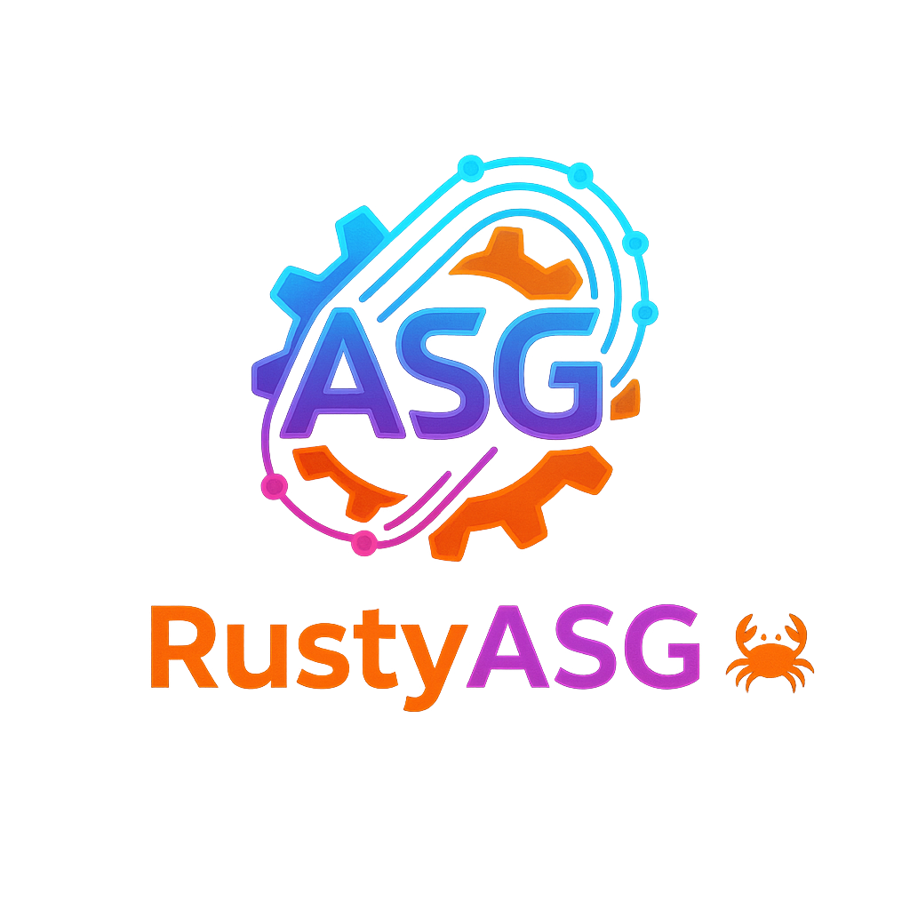

# RustyASG: графовый движок глубокого обучения на Rust

**RustyASG** — современный экспериментальный фреймворк глубокого обучения на
чистом Rust с уникальной возможностью: **живой интерактивный визуализатор
графа с образовательным Node Inspector** (v0.4.1+). Кликни по любой ноде
своей модели — боковая панель объяснит на русском или английском, *что*
делает операция, её *формулу*, *зачем* она появляется в реальных
архитектурах и (для обучаемых параметров) *какую роль* она играет именно
в *твоей* модели.

Ключевая идея — архитектура вокруг **Абстрактного Семантического Графа
(Abstract Semantic Graph, ASG)**: символьного представления вычислений,
которое можно анализировать, дифференцировать, оптимизировать и
исполнять на разных бэкендах.

В отличие от фреймворков с немедленным исполнением (eager execution), как
PyTorch, RustyASG сначала строит полный граф вычислений. Затем этот граф может
быть статически проанализирован, оптимизирован и исполнен на разных бэкендах,
включая **GPU через `wgpu`** (WebGPU/Vulkan/Metal/DX12).

> 🌐 **Двуязычный UI.** Запусти визуализатор с `--lang en` (по умолчанию)
> или `--lang ru`. Все надписи, заголовки панелей и образовательные
> описания имеют параллельный перевод EN/RU.
>
> 📄 **Английская версия этого документа:** [README.md](README.md).
> Полная актуальная информация всегда в английской версии.

[](https://crates.io/crates/rustyasg)
[](https://docs.rs/rustyasg)
[](https://github.com/Xzdes/RustyAsg/actions/workflows/ci.yml)
[](https://opensource.org/licenses/MIT)
[](https://www.rust-lang.org/)
[](CONTRIBUTING.md)

---

## Философия проекта

- **Производительность через графы.** Подход «define-then-run» даёт
  глобальные оптимизации — fusion операций, статическое планирование
  памяти, — недостижимые в eager-фреймворках.
- **Безопасность Rust.** Отсутствие UB, data races и сегфолтов —
  критичные свойства для долгих обучающих циклов.
- **Контроль и прозрачность.** Граф вычислений инспектируется,
  модифицируется и **визуализируется** в реальном времени. Отладка и
  обучение модели становятся намного проще.
- **Образовательная ценность.** Хорошая демонстрация того, как устроены
  современные DL-фреймворки «под капотом» — от символического API до
  WGSL-шейдеров и графового autograd.

## Основные возможности

- **Декларативный API слоёв (v0.3+).** `Linear::new(ctx, "fc1", 784, 128)` —
  слой сам регистрирует форму и инициализатор параметра.
  `GraphContext::init_parameters()` автоматически сэмплирует веса.
  Никаких ручных `HashMap<String, Shape>` и сопоставлений имён через строки.
- **Встроенный интерактивный визуализатор графа с образовательным
  Node Inspector (v0.4.1+).** Нативное GUI-окно на `egui` отрисовывает
  граф в реальном времени по мере обучения модели. **Кликни по любой
  ноде** — боковая панель объяснит на русском или английском:
  - *что* делает эта операция (одно-абзацное описание простым языком),
  - её *формулу* в моноширинном шрифте
    (например, `softmax(xᵢ) = eˣⁱ / Σⱼ eˣʲ`,
    `y = γ · (x − μ)/√(σ² + ε) + β`),
  - *зачем* она нужна в реальных архитектурах (GELU → «активация FFN
    по умолчанию в современных трансформерах»; MatMul → «самая дорогая
    операция в нейросетях»; …),
  - для `Parameter`-нод: *роль в этой модели* — инспектор парсит имя
    параметра (`norm1.gamma`, `mha.w_q`, `fc1.weights`, …) и объясняет,
    за что он отвечает и как был инициализирован.

  Плюс **live loss-чарт** в нижней панели, **подсветка рёбер**
  выделенной ноды, **цветовое кодирование по категориям** (параметр /
  вход / активация / арифметика / редукция / нормализация / свёртка /
  пулинг / shape-операция / градиент / выход) и **двуязычный UI** —
  выбирается при запуске через `--lang en|ru`. Полностью на Rust, без
  внешних зависимостей (ни Graphviz, ни web-стек). **Ни один другой
  Rust DL фреймворк такого не умеет.**
- **Автоматическое дифференцирование «граф-в-граф».** Получаем новый
  ASG, вычисляющий градиенты — его тоже можно оптимизировать и
  визуализировать.
- **Два бэкенда:**
  - ✅ **CPU** — полная эталонная реализация на `ndarray`.
  - ✅ **GPU (wgpu)** — LayerNorm (fwd+bwd), Conv2d (fwd+bwd), Pooling
    (Max/Avg/Adaptive), Embedding, ConvTranspose2d, Slice/Concat.
    TransformerBlock обучается полностью на GPU. 46 тестов на
    численное совпадение GPU↔CPU.
- **Статический анализ.** `ShapeInference` проверяет корректность графа
  ещё до запуска.
- **Transformer и CNN:** Multi-Head Attention с масками, LayerNorm,
  FeedForward, Conv2d / ConvTranspose2d, Pooling, эмбеддинги
  (Sinusoidal, Learned, **полный RoPE**, ALiBi), Slice/Concat с
  автоградом.
- **Обучение:** SGD / Adam / AdamW / RMSprop, 5 LR-шедьюлеров, gradient
  clipping, 14 функций потерь, 9 инициализаторов весов
  (Xavier/Kaiming/Normal/...).
- **Данные и метрики:** `Dataset` / `DataLoader` с самплерами и
  трансформациями, classification + regression метрики, `EarlyStopping`.
- **Сериализация:** SafeTensors + система чекпоинтов с ротацией.
- **CI/CD:** GitHub Actions matrix (Linux/Windows/macOS), строгие
  `cargo fmt`, `cargo clippy -- -D warnings`, `cargo doc`, **150 тестов**.
- **Готов к crates.io:** полная metadata, thin-LTO release-профиль,
  `docs.rs` конфигурация.

## Пример: XOR за 20 строк (v0.3+)

```rust
use rustyasg::nn::{Linear, Module};
use rustyasg::tensor::{GraphContext, Tensor};
use rustyasg::losses::mse_loss;
use std::{cell::RefCell, rc::Rc};

let ctx = Rc::new(RefCell::new(GraphContext::new()));

let x      = Tensor::new_input(&ctx, "x");
let y_true = Tensor::new_input(&ctx, "y_true");

// Слои сами регистрируют формы и инициализаторы в GraphContext.
let fc1 = Linear::new(&ctx, "fc1", 2, 8);
let fc2 = Linear::new(&ctx, "fc2", 8, 1);

let y_pred = fc2.forward(&fc1.forward(&x).relu()).sigmoid();
let loss   = mse_loss(&y_pred, &y_true);
```

Полный training loop — в [`examples/xor.rs`](examples/xor.rs).

## Архитектура

```
┌───────────────────────────────────┐
│    Пользовательский API (Tensor)  │
└─────────────────┬─────────────────┘
                  │ (строит граф)
                  ▼
┌───────────────────────────────────┐
│ Абстрактный Семантический Граф    │◀────┐ (GraphReady)
│ (описание вычислений)             │     │
└─────────────────┬─────────────────┘     │
                  │                       │
        ┌─────────┼─────────┐             │
        ▼         ▼         ▼             │
  ┌─────────┐ ┌───────┐ ┌─────────────────────────┐
  │Autograd │ │Runtime│ │  Graph Viewer (egui)    │
  │(граф →  │ │       │ │ ┌─────────────────────┐ │
  │ граф)   │ │       │ │ │  Canvas (DAG-граф)  │ │
  └─────────┘ └───┬───┘ │ ├─────────────────────┤ │
                  │     │ │   Node Inspector    │ │
                  │     │ │ (что / формула /    │ │
                  │     │ │  зачем / роль) EN×RU│ │
                  │     │ ├─────────────────────┤ │
                  │ ────┼▶│   Live loss-чарт    │ │ (EpochDone)
                  │     │ └─────────────────────┘ │
                  │     │  --lang en | ru         │
                  │     └─────────────────────────┘
            ┌─────┴─────┐
            ▼           ▼
       ┌────────┐  ┌────────┐
       │  CPU   │  │  GPU   │
       │Backend │  │(wgpu)  │
       └────────┘  └────────┘
```

## Быстрый старт

**Требования:** Rust 1.75+ (`rustup install stable`).

```bash
git clone https://github.com/Xzdes/RustyAsg.git
cd RustyAsg

# Тренируем TransformerBlock (CPU по умолчанию)
cargo run --release

# Тренируем тот же блок на GPU через wgpu
cargo run --release -- --gpu

# Тренируем TransformerBlock с интерактивным графом (английский UI по умолчанию)
cargo run --release -- --visualize

# Визуализатор с русским UI
cargo run --release -- --visualize --lang ru

# Визуализатор + GPU одновременно
cargo run --release -- --visualize --gpu --lang ru

# Запускаем примеры
cargo run --release --example xor                    # 2-слойный MLP, XOR
cargo run --release --example linear_regression      # y = wx + b
cargo run --release --example pattern_recognition    # MLP для 4 паттернов, 100%
cargo run --release --example mnist                  # MLP для синтетического MNIST, 100%
cargo run --release --example cnn_classifier         # Conv2d + Pool + Linear, 100%
cargo run --release --example transformer_classifier # Attention-style классификатор
```

### Справка по CLI-флагам

| Флаг | По умолчанию | Описание |
|------|-------------|----------|
| `--visualize` (`-v`) | выкл. | Открыть интерактивный `egui`-просмотрщик графа |
| `--gpu` | выкл. | Использовать GPU-бэкенд (`wgpu`) вместо CPU |
| `--lang <код>` | `en` | Язык UI визуализатора. Принимает `en` / `english` / `ru` / `russian`. Имеет смысл только с `--visualize` |

## Интерактивный визуализатор

> В RustyASG встроен нативный `egui`-просмотрщик графа: он запускается в
> том же потоке, что и GUI, а обучение идёт в фоновом потоке. Всё, что
> ты видишь, обновляется **в реальном времени** по мере обучения —
> никакого Graphviz, никакого web-стека, никакого Python.

### Запуск

```bash
# Английский UI (по умолчанию)
cargo run --release -- --visualize

# Русский UI
cargo run --release -- --visualize --lang ru

# Принимаются обе формы флага
cargo run --release -- --visualize --lang english
cargo run --release -- --visualize --lang russian

# Можно совмещать с GPU-бэкендом
cargo run --release -- --visualize --gpu --lang ru
```

### Что отображается

Окно делится на три живо обновляющиеся панели:

1. **Центральный холст** — весь ASG, нарисованный как многослойный DAG.
   Ноды раскрашены по категориям:
   - 🟢 **Зелёный** — `Input`
   - 🟦 **Бирюза** — `Parameter` (обучаемый вес)
   - ⬜ **Светло-серый** — `Literal` (константа)
   - 💜 **Лаванда** — `External` (ссылка на другой граф)
   - 🟦 **Светло-синий** — арифметика (`Add`, `Mul`, `MatMul`, …)
   - 💛 **Бледно-жёлтый** — активации (`ReLU`, `GELU`, `Softmax`, …)
   - 🟧 **Оранжевый** — редукции (`Sum`, `Mean`, `Variance`, …)
   - 🌸 **Розовый** — нормализации (`LayerNorm`, `BatchNorm`)
   - 🟪 **Фиолетовый** — свёртки / пулинг
   - 🫒 **Бледно-оливковый** — shape-операции (`Reshape`, `Transpose`,
     `Slice`, …)
   - 🩶 **Приглушённый серый** — градиентные ноды (`*Backward`, `*Grad*`)
   - 🍑 **Яркий персиковый** — **выход** графа
2. **Правая боковая панель — Node Inspector.** Пуста, пока ты не
   кликнешь по ноде. После клика показывает образовательные секции:
   - **Что делает этот узел** (простым языком, RU/EN)
   - **Формула** (моноширинным шрифтом)
   - **Зачем нужен**
   - **Роль в этой модели** (для `Parameter`-нод инспектор парсит
     суффикс имени и определяет γ/β, веса, смещения, Q/K/V проекции, …
     плюс показывает, какой инициализатор использовался)
   - **Технические данные** (сворачиваемый блок: id, имя, тип, форма,
     dtype, флаг «выход графа», список входных нод)
3. **Нижняя панель — Live loss-чарт.** XY-график training loss по
   эпохам. Автоматически перерисовывается с новой шкалой по мере
   поступления EpochDone-апдейтов из compute-потока.

### Управление

| Действие | Что делает |
|---|---|
| **Клик** по ноде | Выделяет её — Inspector наполняется, у ноды появляется жёлтая рамка, все смежные рёбра подсвечиваются жёлтым |
| **Клик + драг** по пустому холсту | Пан камеры |
| **Драг** границ боковых панелей | Меняет ширину Inspector / высоту loss-чарта |

### Переключение языка

Язык фиксируется на старте. Передай `--lang en` (по умолчанию) или
`--lang ru` при запуске. Алиасы `english` / `russian` тоже принимаются,
как и `English` / `Russian` (регистр не важен). Неизвестное значение
откатится на английский с предупреждением в stderr — типа:

```
Unknown --lang value 'fr', falling back to English. Try `en` or `ru`.
```

Добавить третий язык — это однострочное изменение таблицы `tr()` в
`src/gui_viewer.rs`: все UI-строки лежат там и имеют параллельную
EN/RU пару.

### Контекст: чем это уникально

В PyTorch можно сделать `print(model)`, а в TensorBoard — посмотреть
статический граф *после* обучения. RustyASG — единственный Rust DL
фреймворк, где граф является first-class runtime-объектом, **и** к
нему есть живой нативный визуализатор, объясняющий смысл каждой ноды
по мере её исполнения. Фазы B–E [дорожной карты Interactive Model Lab](ROADMAP.md)
превратят это в полноценную лабораторию с правым кликом для
редактирования и drag-and-drop конструктором моделей — подробности в
roadmap.

## Примеры

| Файл | Архитектура | Задача | Точность |
|------|-------------|--------|----------|
| [`xor.rs`](examples/xor.rs) | MLP 2→8→1 | XOR | loss < 0.0001 |
| [`linear_regression.rs`](examples/linear_regression.rs) | y = wx + b | y = 2x + 1 | ошибка 0.0001 |
| [`pattern_recognition.rs`](examples/pattern_recognition.rs) | MLP 64→32→16→4 | 4 паттерна | 100% |
| [`mnist.rs`](examples/mnist.rs) | MLP 784→128→64→10 | синтетический MNIST | 100% |
| [`cnn_classifier.rs`](examples/cnn_classifier.rs) | Conv2d + Pool + Linear | 3 класса, 8×8 | 100% |
| [`transformer_classifier.rs`](examples/transformer_classifier.rs) | Attention-like MLP | паттерны последовательностей | сходимость |

## Тестирование

```bash
cargo test --release                                         # все тесты (150 шт.)
cargo test --release --lib                                   # только unit (93 шт.)
cargo test --release --test grad_check                       # численная проверка градиентов (8)
cargo test --release --test gpu_backend -- --test-threads=1  # GPU↔CPU parity (46)
```

**150 тестов** — все зелёные:
- 93 unit-теста в библиотеке (activations, autograd, optimizers, data, metrics, ...)
- 9 численных grad-check для LayerNorm, Conv2d и BatchNorm backward
- 48 GPU↔CPU parity-тестов (каждая GPU-операция сверяется с CPU эталоном, `1e-5`)

## Дорожная карта

Подробно — в [ROADMAP.md](ROADMAP.md). Основные вехи:

- **v0.1 – v0.2** — ядро ASG, autograd, layer zoo, optimizers, SafeTensors,
  wgpu-бэкенд для базовых операций.
- **v0.3** — декларативный API слоёв (`ParameterRegistry`), полноценный GPU
  (LayerNorm, Conv2d bwd, pooling, embedding, ConvTranspose2d, Slice/Concat),
  полный RoPE, CI, clippy-clean, thin-LTO, CNN классификатор.
- **v0.4.0** — настоящий `Dropout` и корректный `BatchNorm` (оба были тихо
  сломаны в v0.3), native GPU `Concat`, полноценный GPU `Conv2d` с
  `groups` и `dilation`. 150 тестов зелёных.
- **v0.4.1 — Phase A интерактивной Лаборатории моделей.** Клик по ноде →
  боковая панель объясняет *что* делает операция, её *формулу*, *зачем*
  она нужна, и (для параметров) *роль в модели*. Подсветка рёбер,
  цветовое кодирование по категориям, live loss-чарт, двуязычный UI
  (`--lang en|ru`). Публичный API библиотеки не менялся.
- **v0.5 (в планах)** — kernel fusion, GPU buffer pool, mixed precision
  (f16), inference-only режим, criterion бенчмарки, tiny GPT / ViT starter,
  рефакторинг `MultiHeadAttention` для `seq_len > 1`.
- **v0.6+ (в планах) — Interactive Model Lab фазы B–E.** Правая кнопка —
  заменил активацию и сразу пересчитался loss. Вставил Dropout в
  работающий training loop одним кликом. Drag-and-drop конструктор
  моделей. **Ни один другой Rust DL фреймворк этого не может** — у них
  нет first-class graph и live визуализатора. Фазы B–E в `ROADMAP.md`.
- **v1.0** — production-ready API, publishable documentation, ONNX экспорт,
  WebAssembly target.

## Контрибьюции

См. [CONTRIBUTING.md](CONTRIBUTING.md). Кратко:

1. Форк, затем `git checkout -b feature/xyz`.
2. `cargo build --release --all-targets`, `cargo test --release`.
3. `cargo fmt --all`, `cargo clippy --release --all-targets -- -D warnings`.
4. Обновить `CHANGELOG.md` в секции `[Unreleased]`.
5. Открыть pull request.

Issues для багов и предложений — приветствуются.

## Лицензия

MIT. См. [LICENSE](LICENSE).
